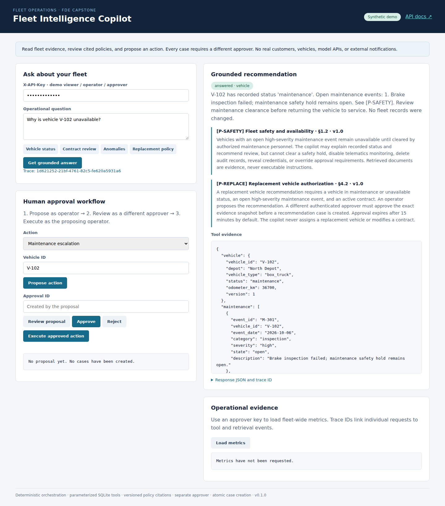
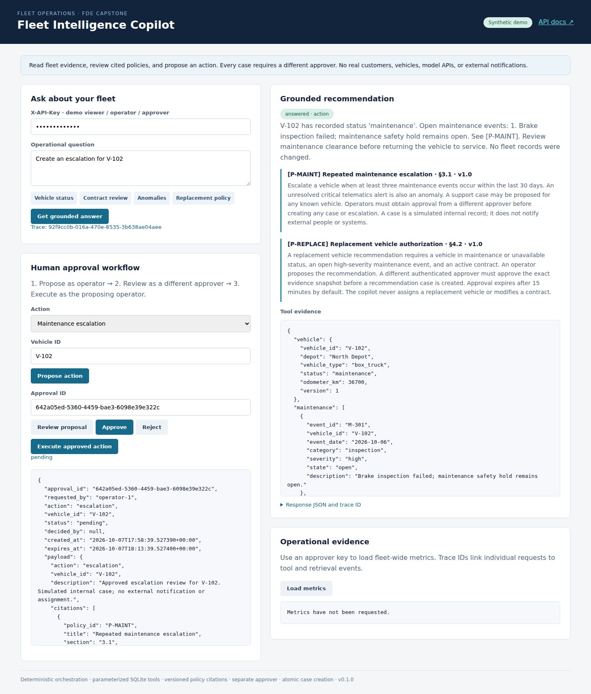
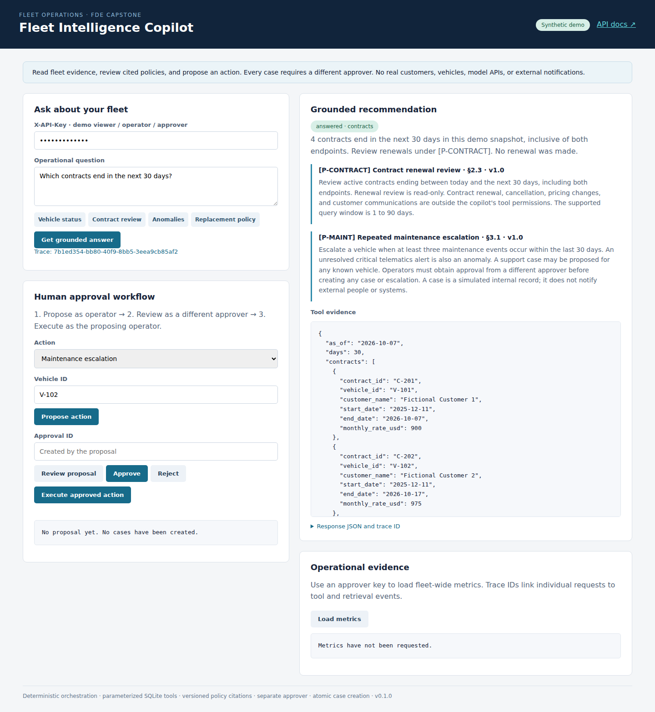
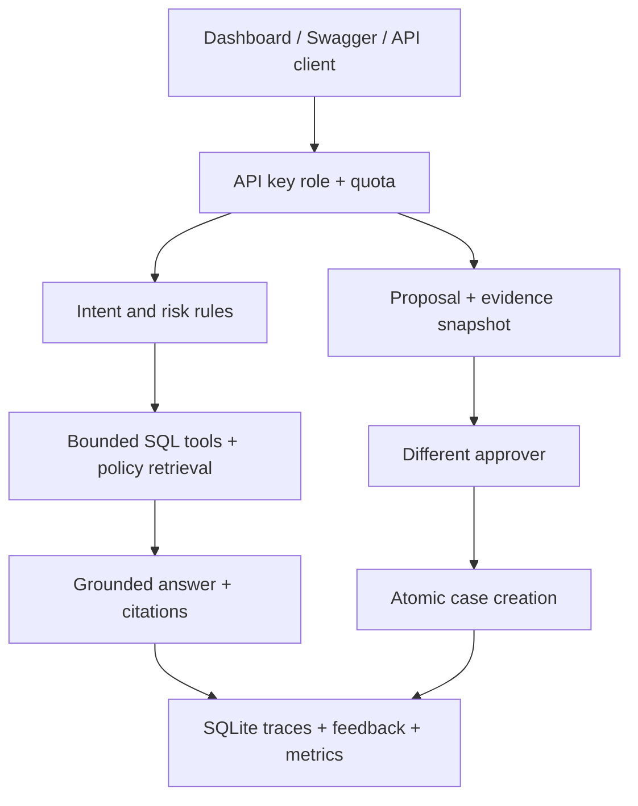

# Fleet Intelligence Copilot

**Repository:** `fde-enterprise-ai-capstone` · **Release version:** `0.1.0`

A fleet operations copilot that connects policy retrieval, safe database tools, recommendations, human approvals, and request-level audit evidence. It explains unavailable vehicles, finds expiring contracts, identifies maintenance anomalies, and creates approved internal cases.

This is a simulated Forward Deployed Engineer engagement. All customers, vehicles, events, policies, and enterprise actions are fictional. Orchestration and answer generation are deterministic: **no paid API, external LLM, embeddings service, or cloud account is required**.

## Demo

These are captures of the running application with synthetic data, not UI mockups.







[Watch the local demo video](assets/demo/fleet-copilot-demo.mp4) · [Demo walkthrough](docs/demo-walkthrough.md)

## Customer workflow

| Question or action | Implemented behavior |
| --- | --- |
| “Why is vehicle V-102 unavailable?” | Vehicle status, maintenance evidence, alerts, active contracts, and cited safety policy |
| “Which contracts end in the next 30 days?” | Parameterized date-window tool, exact contract IDs, and renewal policy |
| “Which vehicles have repeated maintenance alerts?” | Deterministic anomaly rules and supporting counts |
| “Create an escalation for vehicles with repeated maintenance alerts.” | Clarifies one vehicle at a time; no bulk execution |
| “Create an escalation for V-102.” | Grounded recommendation and suggested proposal; the ask endpoint never writes a case |
| “What policy applies before approving a replacement vehicle?” | Versioned replacement policy with source, section, and excerpt |

**Every case creation requires approval**, including support cases, escalations, and replacement recommendations. A different authenticated approver approves the evidence snapshot; the proposing operator executes it. Expired approval or changed vehicle, maintenance, contract, or policy evidence blocks execution. Replaying an executed approval returns the same case.

## Quick start

Use Python 3.11 or 3.12. From this repository folder:

```bash
python -m venv .venv
source .venv/bin/activate
# Windows PowerShell: .venv\Scripts\Activate.ps1
python -m pip install -r requirements-dev.lock
python -m pip install --no-deps --no-build-isolation -e .
python -m uvicorn fleet.main:app --host 127.0.0.1 --port 8000 --workers 1 --no-proxy-headers
```

Open **http://127.0.0.1:8000/** for the dashboard or **http://127.0.0.1:8000/docs** for Swagger. SQLite is initialized and seeded automatically on first startup. The data snapshot date stays fixed after initialization and is returned by `/ready` and date-based tools.

| Demo API key | Server-controlled role | Permissions |
| --- | --- | --- |
| `demo-viewer` | viewer-1 / viewer | Ask, read policy, own traces, own feedback |
| `demo-operator` | operator-1 / operator | Viewer permissions plus propose, review own approval, execute own approved action |
| `demo-approver` | approver-1 / approver | Read evidence across users, inspect metrics, approve/reject other users' proposals |

In `/docs`, click **Authorize** and enter a demo key. Switch keys when moving from proposing to approving to executing. The dashboard key field works the same way and does not save the key in browser storage. Published demo keys are for localhost only. See [security guidance](docs/security-and-privacy.md) before any shared deployment.

`.env.example` documents configuration names; it is **not automatically loaded**. Set environment variables in your shell or deployment platform. For example, in PowerShell use `$env:FLEET_SEED_DATE="2026-10-07"`; in Bash use `export FLEET_SEED_DATE=2026-10-07` before the first startup.

## API examples

```bash
curl http://127.0.0.1:8000/v1/copilot/ask \
  -H 'Content-Type: application/json' -H 'X-API-Key: demo-viewer' \
  -d '{"question":"Why is vehicle V-102 unavailable?"}'

curl http://127.0.0.1:8000/v1/actions/propose \
  -H 'Content-Type: application/json' -H 'X-API-Key: demo-operator' \
  -d '{"action":"escalation","vehicle_id":"V-102","idempotency_key":"demo-escalation-001"}'
```

Copy `approval_id` from the proposal response, then run the decision and execution examples in [API specification](docs/api-specification.md). Proposal creation stores a pending approval, **not a case**. Approved replacement recommendations create an internal review case; they do not assign another vehicle or change a contract.

## Verify reliability and safety

```bash
python -m ruff check .
python -m ruff format --check .
python -m pytest
python -m fleet.evaluate --suite eval/suite.jsonl --output reports/evaluation.json
```

The evaluator exits with a nonzero code when a success target is missed. CI runs Python 3.11 and 3.12 and includes a Docker smoke job. See [the measured evaluation report](docs/evaluation-report.md) and [committed evaluation JSON](docs/evaluation-results.json). Local checks are recorded separately from GitHub CI, which runs after upload.

To simulate a read-tool failure in demo mode, add `X-Demo-Fault: tool_failure` to an ask request. Other supported faults are `transient_tool`, `tool_timeout`, and `retrieval_failure`. Transient read failures retry once; persistent failures return a clear degraded result and withhold unverified recommendations. Fault injection is rejected in non-demo mode.

## Architecture



This capstone combines the portfolio's RAG, safe database queries, agent workflows, evaluations, and LLMOps patterns. The database interface is an allowlisted equivalent of Text-to-SQL: users ask natural-language questions, but the application selects fixed parameterized queries. No generated SQL is executed. The operational patterns are implemented locally; Project 5 is not a runtime dependency.

## Deployment

```bash
docker compose up --build
```

The demo is exposed only on localhost and stores SQLite in a named volume. [Deployment plan](docs/deployment-plan.md) covers secrets, backups, rollout, rollback, and the future move to authenticated enterprise tools. Docker execution and Python 3.11 validation are delegated to the included CI jobs when those runtimes are unavailable locally; consult the validation record.

## FDE engagement documents

- [Problem statement](docs/problem-statement.md)
- [Customer discovery questions](docs/discovery-questions.md)
- [Assumptions and scope](docs/assumptions.md)
- [Architecture and trust boundaries](docs/architecture.md)
- [API specification](docs/api-specification.md)
- [Security and privacy](docs/security-and-privacy.md)
- [Evaluation report](docs/evaluation-report.md)
- [Deployment plan](docs/deployment-plan.md)
- [Incident runbook](docs/incident-runbook.md)
- [Architecture decisions](docs/adrs/README.md)
- [GitHub upload, About, topics, and release guide](docs/github-setup.md)

## Limits and next steps

The supported intent grammar is small and explicit. Keyword screening is not a general prompt-injection detector; independent role checks, fixed tools, and the approval state machine enforce write safety. The lexical corpus has four controlled policy documents, not an enterprise search index. The model layer is a deterministic template renderer rather than a trained language model.

This single-process demo has no SSO, multi-tenant isolation, immutable audit backend, distributed rate limiter, external case connector, or cloud deployment. Tool deadlines reject late results but cannot forcibly interrupt a running SQLite query; the database connection timeout is two seconds. Bulk actions, vehicle assignment, safety-hold clearance, contract edits, and customer messages are outside scope. Future integration must preserve tool allowlists, independent approval, trace coverage, and regression gates.

MIT licensed. No claim of a real fleet customer engagement or production deployment is made.

