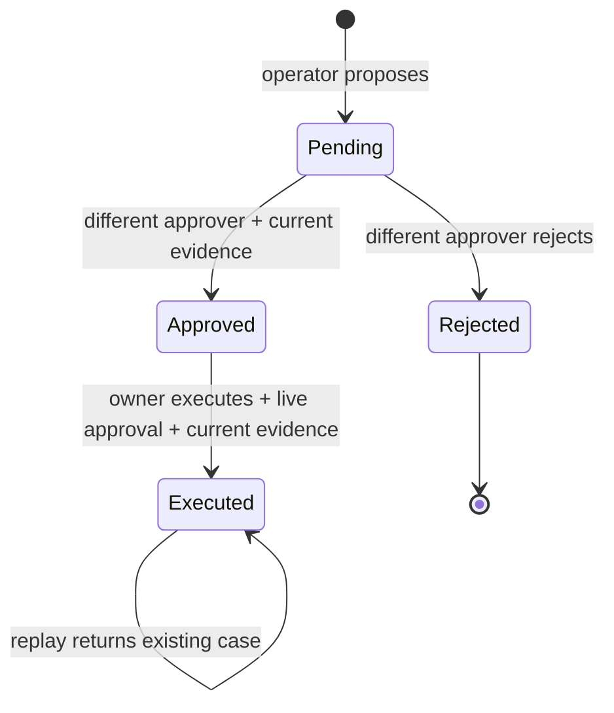

# Architecture and trust boundaries

## Components

| Component | Responsibility | Boundary |
| --- | --- | --- |
| FastAPI + dashboard | Validate request structure; present evidence and approval state | Browser input is untrusted; DOM uses textContent for API data |
| API key mapping | Resolve immutable role and user ID from configured key | Roles never come from a request body or role header |
| Orchestrator | Classify bounded intents, choose read tools, return templates | Natural language cannot become SQL or executable instructions |
| Tools | Fixed SQL for vehicle, contracts, counts, and anomaly lookup | Values use placeholders; vehicle/date inputs are bounded |
| Policy retriever | Rank controlled policy documents and emit complete citations | Documents provide evidence; policy text never executes tools |
| Approval service | Bind payload to current evidence; separate approver; expire approval | Approval does not trust the ask endpoint or a user-supplied approval flag |
| SQLite store | Seed, retain evidence, atomically create approved cases | Filesystem and database administrators remain privileged |
| Audit and metrics | Request traces, action events, latency, retries, outcomes, score feedback | Credentials and raw questions are omitted from application traces |

## Action state machine

Expiry and stale evidence are checked before decision or execution; they return HTTP 409 and require a new proposal. They do not silently rewrite the proposal or create a replacement approval. A unique per-operator idempotency key prevents duplicate proposals. A unique case approval ID prevents duplicate execution.

## Evidence snapshot

The digest covers action type, vehicle fields and version, maintenance events, unresolved alerts, active contracts, and the relevant policy document. The digest is recomputed within `BEGIN IMMEDIATE` before execution. Approval has a default 900-second lifetime measured against UTC wall time. Cases, approval transition, and action audit commit together; a ledger failure rolls all three back.

HTTP request traces are written after handler completion. If request-trace persistence fails after an action committed, the API returns an explicit 503 with `trace_persisted: false`. The transactional action ledger still records the committed action. Inspect approval/case state before retrying; execution replay returns the same case. Local audit files are durable but not tamper-proof.

## Operational flow

Completed `/v1/` requests receive an `X-Trace-ID` and a durable trace when SQLite is available, including authentication, quota, and validation errors. The trace stores a route template, status, role-resolved user ID, latency, outcome, retrieval IDs, and read-tool attempt events. It does not store a prompt, request body, model response, or API key. Health, readiness, static pages, and docs have trace headers but do not populate business-request metrics.

Metrics use the last 24 hours, capped at the most recent 10,000 traces. Percentiles use the nearest-rank method. HTTP error rate includes 4xx and 5xx; degraded 200 responses have a separate rate. The metrics request itself appears in subsequent summaries, after its own trace is persisted.

## Future enterprise integration

Replace local read tools with scoped source-system adapters, retain the fixed operation schema, and add request deadlines/circuit breakers around network calls. Move identities to SSO, rate limits to a shared store, and data to a transactional service with tenant isolation. Add a model only behind constrained structured outputs and evidence checks. Do not grant a model direct SQL access or write credentials.

